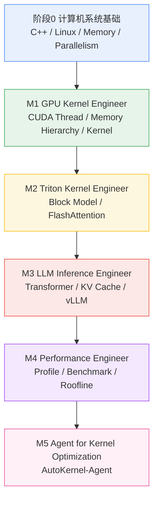
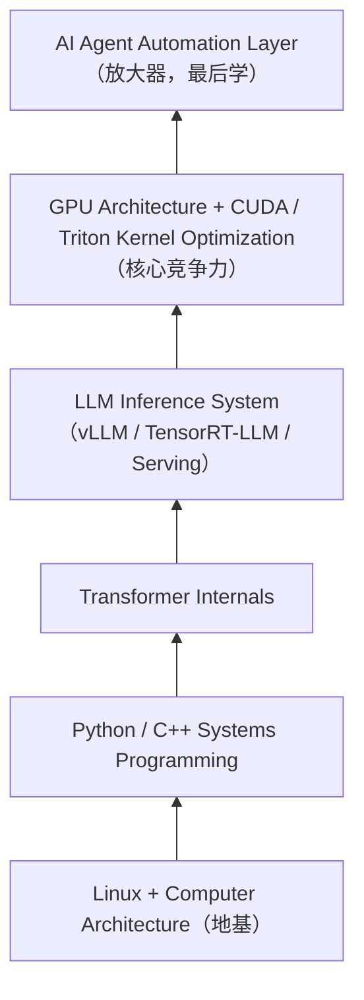

# AI Systems Engineer 自学计划：LLM Infra / GPU Optimization / Kernel Agent

> 目标岗位：**AI Systems Engineer**（LLM 推理 / GPU Kernel / AI Infra 方向）
> 核心路线：**系统基础 → GPU/CUDA → Triton Kernel → LLM 推理系统 → 性能工程 → Agent 自动化**
> 原则：**Agent 是上层放大器，不是基础。** 不先学 Agent 框架、不跳过 Kernel。
> 编制日期：2026-09-26 ｜ 预计总周期：**约 32 周（7–9 个月，按每周 15–20 小时投入）**

---

## 0. 全局总览

### 0.1 技术依赖链（严格按此顺序，不可跳级）



### 0.2 能力优先级金字塔（越底层越优先投入）



### 0.3 资源标签与难度说明

| 标签 | 含义 |
|---|---|
| 【入门】 | 零基础可直接学，建立概念与动手直觉 |
| 【进阶】 | 需要前置基础，用于达到岗位深度 |
| 【源码】 | 源码/论文精读，岗位区分度最高 |
| 【面试必备】 | 面试高频、岗位 JD 硬要求，必须能讲清 |

- 难度：★☆☆ 入门 ｜ ★★☆ 中级 ｜ ★★★ 进阶
- 语言：中 / 英（中英资源均给出，英文原版为一手资料）
- 链接若随版本变化，以「官方名称 + 搜索关键词」为准，不依赖可能失效的深链。

### 0.4 环境与硬件准备（开工前一次性搞定）

- 一张 NVIDIA GPU 即可：本地 RTX 3060 12GB / 云租 T4、A10、A100（AutoDL、揽睿星舟等按时计费，单卡约 ¥1–8/小时）；Colab 免费 T4 可做入门练习。
- 软件栈：Ubuntu 20.04/22.04、NVIDIA Driver、CUDA Toolkit 12.x、`nvidia-smi`、Docker + NVIDIA Container Toolkit、gcc/g++、gdb、cmake、ninja、conda、VS Code（C++/CUDA 插件）。
- 每个项目都建 Git 仓库，README 记录环境、复现命令、性能数据——**GitHub 提交记录就是求职作品集**。

---

# 阶段 0：系统编程基础（6–8 周）

## 学习目标

1. 能用 C++ 写出内存安全、理解对象生命周期的系统级代码，并能通过 pybind11 暴露给 Python（CUDA Extension 接口形态）。
2. 理解 Linux 进程/线程、虚拟内存、调度、系统调用与 IPC，会用 `strace/lsof/perf/numactl` 观察程序。
3. 建立并行计算演进的完整心智模型：Serial → Thread Parallel → SIMD → GPU SIMT。

## 必学知识点清单

- [ ] C++：内存布局（栈/堆/全局区、对象内存排布、对齐 padding）、指针与引用、值语义
- [ ] RAII、智能指针（unique_ptr / shared_ptr）、拷贝控制（拷贝/移动/析构，Rule of 0/3/5）
- [ ] STL 容器与泛型算法、函数模板/类模板基础、std::thread / mutex / condition_variable
- [ ] Linux：process vs thread、fork/exec/wait、signal、file descriptor、system call 边界
- [ ] 虚拟内存：页表、TLB、缺页、mmap、用户态/内核态切换
- [ ] 调度器：上下文切换、调度策略、多核、NUMA 拓扑与访存代价
- [ ] IPC：pipe、共享内存、消息队列、socket
- [ ] 并行演进：多线程、SIMD（一条指令处理多数据）、SIMT（GPU 硬件调度整 warp）

## 推荐资源

| # | 资源 | 作者/机构 | 链接 / 搜索关键词 | 语言 | 难度 | 预计时长 | 必/选看 | 对应知识点 | 标签 |
|---|---|---|---|---|---|---|---|---|---|
| 0-1 | **《C++ Primer（第5版）》** | S. Lippman 等 | 搜索「C++ Primer 5th 中文版」；重点：**Ch2 变量与基本类型、Ch3 字符串/向量/数组、Ch6 函数、Ch7 类、Ch9 顺序容器、Ch10 泛型算法、Ch11 关联容器、Ch12 动态内存（智能指针/RAII）、Ch13 拷贝控制（含 13.6 移动语义）、Ch16 模板与泛型编程、Ch17 特殊工具（tuple/bitset）** | 中译/英 | ★★☆ | 4 周（挑章节精读+习题） | 必看 | 内存布局、指针引用、RAII、STL、Template | 【入门】【面试必备】 |
| 0-2 | **Effective Modern C++** | Scott Meyers | 搜索「Effective Modern C++ 中文版」；重点：Ch3 右值引用/移动、Ch4 智能指针（条款 18–22）、Ch5 lambda、Ch1 类型推导 | 中译/英 | ★★★ | 1 周（选读 20 条） | 选看 | RAII、现代 C++ 语义 | 【进阶】【面试必备】 |
| 0-3 | **C++ Concurrency in Action（2nd）** | Anthony Williams | 搜索「C++ Concurrency in Action 2nd」；**Ch2 线程管理、Ch3 共享数据与互斥、Ch4 同步操作（future/promise）、Ch5.1–5.3 内存模型与原子** | 英（有中译《C++并发编程实战》） | ★★★ | 1 周 | 必看（Ch2–3）/选看（Ch5） | std::thread、锁、内存序 | 【进阶】 |
| 0-4 | **《深入理解计算机系统》CSAPP（第3版）** | R. Bryant, D. O'Hallaron | http://csapp.cs.cmu.edu/ ；中译《深入理解计算机系统》；**Ch1 漫游、Ch6 存储器层次结构、Ch7 链接、Ch8 异常控制流（系统调用/进程/信号）、Ch9 虚拟内存、Ch10 系统级 I/O（fd）、Ch12 并发编程（线程/同步/竞争）**；Ch2–3 按需补 C 与汇编 | 中译/英 | ★★☆ | 3 周（与 0-1 并行） | 必看 | 内存层次、虚拟内存、系统调用、fd、并发 | 【入门】【面试必备】 |
| 0-5 | **OSTEP 操作系统导论（免费）** | R. & A. Arpaci-Dusseau | 英文 https://pages.cs.wisc.edu/~remzi/OSTEP/ ；中文 PDF https://pages.cs.wisc.edu/~remzi/OSTEP/Chinese/ ；**Ch4–5 进程与 API、Ch6 受限直接执行、Ch7–10 调度（含多核调度）、Ch13 地址空间、Ch14 内存 API、Ch16 分段、Ch18 分页、Ch19 TLB、Ch20 高级页表、Ch21 交换、Ch26–27 线程与线程 API、Ch28 锁、Ch29 条件变量、Ch32 常见并发 bug** | 中/英 | ★★☆ | 2 周（挑章） | 必看 | 进程线程、虚拟内存、调度器、锁 | 【入门】 |
| 0-6 | **Linux man-pages（在线手册）** | man7.org | https://man7.org/linux/man-pages/ ；查 `fork(2)`、`mmap(2)`、`pipe(7)`、`shm_overview(7)`、`pthread_create(3)`、`numa(7)` | 英 | ★★☆ | 随查 | 必看（工具） | 系统调用、fd、IPC | 【源码】 |
| 0-7 | **NUMA / 拓扑观察实操** | Linux 内核文档 + hwloc | 搜索关键词「Linux kernel numa_memory_policy documentation」「hwloc lstopo tutorial」；动手：`lstopo`、`numactl --hardware`、`numastat`、`taskset`，跑一个跨 NUMA 访存对比实验 | 英 | ★★☆ | 0.5 周 | 必看（动手） | NUMA、调度、访存局部性 | 【进阶】 |
| 0-8 | **SIMD：Intel Intrinsics Guide + CMU 15-418 GPU 课** | Intel / CMU | Intrinsics Guide：https://www.intel.com/content/www/us/en/docs/intrinsics-guide/index.html （看 SSE/AVX 向量指令概念即可）；CMU 15-418/618（YouTube/B站搜「CMU 15-418 GPU Architecture CUDA」，Lec 5–6 SIMD/SIMT 对比） | 英 | ★★☆ | 0.5 周 | 选看 | SIMD、SIMT 区别 | 【入门】 |
| 0-9 | **PyTorch Custom C++ and CUDA Extensions 教程** | PyTorch 官方 | https://pytorch.org/tutorials/advanced/cpp_extension.html ；配套仓库 https://github.com/pytorch/extension-cpp （读 `cpp/lltm.cpp`、`cuda/lltm_cuda.cpp` + `lltm_cuda_kernel.cu`、`setup.py`，理解 pybind11 绑定 + JIT `load()` 编译形态） | 英（有社区中文翻译） | ★★☆ | 0.5 周 | 必看 | CUDA Extension 接口、pybind11 | 【入门】【面试必备】 |
| 0-10 | 侯捷 C++ 系列视频 /《STL 源码剖析》 | 侯捷 | B站搜「侯捷 C++ 面向对象高级开发」「STL 源码剖析」 | 中 | ★★☆ | 选看 | 选看 | STL 实现、内存管理 | 【进阶】 |

## 最小实战项目（可放 GitHub）

**项目名：`cpp-systems-lab`**（一个仓库多个子目录）

1. `memory_layout/`：用 `-fstack-usage`、`sizeof`、地址打印验证栈/堆/全局区、对象对齐与虚函数表指针；手写一个带析构的 `Buffer` 类体会 RAII。
2. `thread_pool/`：用 `std::thread + mutex + condition_variable + queue` 写一个固定大小线程池，并行处理 1000 个任务，测加速比。
3. `linux_lab/`：用 `fork + pipe` 写多进程管道（仿 shell `cmd1 | cmd2`）；`strace -c` 统计系统调用；`mmap` 实现大文件拷贝。
4. `numa_lab/`：同一段数组求和，对比本节点/跨节点内存分配（`numa_alloc_onnode`）的耗时差。
5. `pybind_ext/`：把一个 C++ 函数（如矩阵逐元素运算）用 pybind11/`torch.utils.cpp_extension.load` 暴露给 Python 调用。

## 验收标准 / 自测题

1. **核心验收题**：解释为什么 CPU 程序直接搬到 GPU 可能反而更慢？（至少答出 4 点）
   - 参考答案要点：① kernel launch overhead（每次启动约数 μs，小 kernel 启动开销 > 计算收益）；② Host↔Device 经 PCIe 传输数据，带宽远低于显存，数据搬运成为瓶颈；③ occupancy 不足（block 内线程太少、寄存器/共享内存占用过高，SM 填不满）；④ 并行度不足（数据量小、任务串行依赖重，GPU 大量核心空转）；⑤ Amdahl 定律：串行部分占比决定加速上限。
2. 手写 RAII 类并说明它如何避免内存泄漏；解释 unique_ptr 与 shared_ptr 所有权区别。
3. 画出一次 `read(fd, ...)` 从用户态到内核态再返回的完整路径。
4. 解释缺页异常（page fault）发生时硬件与 OS 各做了什么。
5. SIMD 和 SIMT 的本质区别是什么？（SIMD 同一指令由 CPU 显式驱动固定宽度向量；SIMT 由 GPU 硬件以 warp 为单位调度，分支可发散）

## 常见坑

- C++ 只看书不写代码：内存/移动语义必须靠调试器和地址打印建立直觉。
- 把「会用 STL」当成「懂内存」：容器扩容、迭代器失效、对象拷贝时机必须能讲清。
- 一上来啃 Linux 内核源码：本阶段只需系统级理解 + 工具观察，不要陷入内核实现。
- 忽视编译工具链：不会用 cmake/ninja/gdb，后面写 CUDA extension 会寸步难行。
- 跳过虚拟内存直接学 CUDA：GPU 的 memory hierarchy 是 CPU 虚拟内存/缓存思想的延伸，地基不牢后面全靠背。

## 建议学习顺序（6 周核心计划，可放宽到 8 周）

| 周 | C++ 线 | 系统/Linux 线 | 产出 |
|---|---|---|---|
| W1 | Ch2–3 类型/数组/字符串；搭好 gcc/gdb/cmake 环境 | CSAPP Ch1、Ch6 存储器层次 | memory_layout 实验 |
| W2 | Ch7 类、Ch12 动态内存（RAII/智能指针） | 命令行基本功：strace/lsof/perf 初体验 | RAII Buffer 类 |
| W3 | Ch9–11 容器与泛型算法；Ch13 拷贝控制与移动 | CSAPP Ch8 异常控制流 | 容器/移动小练习 |
| W4 | Ch16 模板；C++ Concurrency Ch2–3 | OSTEP Ch4–10（进程/调度，挑章） | thread_pool |
| W5 | Concurrency Ch4 同步原语 | CSAPP Ch9–10 + OSTEP Ch13/18–21（虚拟内存） | linux_lab（fork/pipe/mmap） |
| W6 | PyTorch extension 教程 | OSTEP Ch26–29 线程锁；NUMA 实验；SIMD/SIMT 对比阅读 | pybind_ext、numa_lab，过验收题 |

---

# Milestone 1：GPU Kernel Engineer（7 周）

## 学习目标

1. 吃透 GPU 硬件模型（SM、CUDA Core、Tensor Core、各类存储）与 CUDA 执行模型（Grid→Block→Warp→Thread）。
2. 手写并迭代优化 CUDA kernel，核心思路：**减少 Global Memory 访问、增加数据复用**。
3. 会用 Nsight 工具定位瓶颈，用 Roofline 判断 compute bound / memory bound。

## 必学知识点清单

- [ ] 硬件：SM、CUDA Core、Tensor Core、Register File、Shared Memory、L1/L2、HBM/Global Memory
- [ ] 执行模型：Grid / Block / Warp(32 线程) / Thread、SPMD、warp 调度与延迟隐藏
- [ ] Memory Hierarchy：Register → Shared → L1 → L2 → Global，各自带宽/延迟/生命周期
- [ ] 访存模式：coalesced access、shared memory bank conflict、对齐、pinned memory
- [ ] 同步：`__syncthreads()`、warp 内隐式同步、分支发散 warp divergence
- [ ] Occupancy：寄存器/共享内存/block 规模对占用率的影响
- [ ] GEMM 优化阶梯：naive → 合并访存 → shared memory tiling → 寄存器分块 → 向量化/双缓冲 → Tensor Core(WMMA)
- [ ] 工具：Nsight Systems（系统时间线）、Nsight Compute（kernel 级指标）、Roofline

## 推荐资源

| # | 资源 | 作者/机构 | 链接 / 搜索关键词 | 语言 | 难度 | 预计时长 | 必/选看 | 对应知识点 | 标签 |
|---|---|---|---|---|---|---|---|---|---|
| 1-1 | **CUDA C++ Programming Guide（官方编程指南）** | NVIDIA | https://docs.nvidia.com/cuda/cuda-c-programming-guide/ ；**Ch2 Programming Model（Kernels、Thread Hierarchy、Memory Hierarchy、SIMT Architecture）、Ch3 Programming Interface（Runtime、Device Memory、Streams、Events）、Ch5 Hardware Implementation（SM、Shared Memory）、Warp Matrix Functions（WMMA/Tensor Core 章节）** | 英 | ★★☆ | 2 周（精读 Ch2–3，其余随查） | 必看 | 全部硬件/执行/存储模型 | 【入门】【面试必备】 |
| 1-2 | **CUDA C++ Best Practices Guide（最佳实践指南）** | NVIDIA | https://docs.nvidia.com/cuda/cuda-c-best-practices-guide/ ；重点：Execution Configuration、Memory（coalescing/pinned/shared）、Streams 重叠、Instruction Optimization、Performance Metrics 章节 | 英 | ★★★ | 1 周 | 必看 | 访存优化、occupancy、重叠 | 【进阶】【面试必备】 |
| 1-3 | **PMPP《Programming Massively Parallel Processors》4th** | D. Kirk, W. Hwu, I. El Hajj | 搜索「Programming Massively Parallel Processors 4th pdf」；**Ch2 异构数据并行、Ch3 多维 Grid、Ch4 计算架构与调度（SM/Warp/发散/延迟容忍）、Ch5 内存架构与局部性、Ch6 性能考虑、Ch10 Reduction 与最小化发散**；Ch16 Deep Learning 选读 | 英（第3版有中译《大规模并行处理器编程实战》） | ★★☆ | 3 周（Ch2–6、10） | 必看 | 执行模型、内存层级、reduction | 【入门】【面试必备】 |
| 1-4 | **GPU MODE（CUDA MODE）系列讲座** | GPU MODE 社区（Mark Saroufim 等） | 仓库 https://github.com/gpu-mode/lectures （README 有完整有序讲座清单与代码）；YouTube 搜「CUDA MODE」；已核实：**Lec 1 How to profile CUDA kernels in PyTorch、Lec 2 Getting Started with CUDA（Jeremy Howard）、Lec 12 Flash Attention、Lec 14 Practitioner's Guide to Triton** | 英 | ★★☆ | 按需，每集约 1–1.5h | 必看（Lec 1/2） | profiling、CUDA 入门 | 【入门】【进阶】 |
| 1-5 | **NVIDIA DLI：Fundamentals of Accelerated Computing with CUDA C/C++** | NVIDIA DLI | https://learn.nvidia.com 搜课程全名；含「Accelerating CUDA Programs / Managing Memory / Streams」模块，浏览器内可跑 GPU 练习 | 英 | ★☆☆ | 8–10h | 必看（免费部分） | kernel 启动、内存、stream | 【入门】 |
| 1-6 | **How to Optimize a CUDA Matmul Kernel for cuBLAS-like Performance: a Worklog** | Simon Boehm | https://siboehm.com/articles/22/CUDA-MMM （文章内附 GitHub 全部 kernel 代码）；**kernel 1→12：naive → coalescing → shared memory tiling → 寄存器分块 → 向量化加载 → double buffering → Tensor Core 版本** | 英 | ★★★ | 1.5 周（逐个复现） | 必看 | GEMM 优化全阶梯 | 【进阶】【面试必备】 |
| 1-7 | **Nsight Systems User Guide** | NVIDIA | https://docs.nvidia.com/nsight-systems/UserGuide/ ；CLI：`nsys profile`、`nsys stats`、NVTX range；学会看 CPU/GPU 时间线、kernel 间隙、memcpy | 英 | ★★☆ | 0.5 周 | 必看 | 系统级 profile | 【进阶】 |
| 1-8 | **Nsight Compute 文档 + CLI Manual** | NVIDIA | UI/CLI：https://docs.nvidia.com/nsight-compute/NsightComputeCli/ ；重点 section：SpeedOfLight、Memory Workload Analysis、Occupancy、Warp State Statistics、Source Counters、**Roofline Chart**；CLI：`ncu --set full --kernel-name ...` | 英 | ★★★ | 1 周 | 必看 | kernel 指标、roofline、bank conflict | 【进阶】【面试必备】 |
| 1-9 | **Roofline 原始论文** | S. Williams, A. Waterman, D. Patterson | 搜「The Roofline Model CACM 2009」或「Roofline An Insightful Visual Performance Model」；理解 arithmetic intensity、ridge point、compute/memory bound 判定 | 英 | ★★☆ | 0.3 周 | 必看 | Roofline 模型 | 【进阶】【面试必备】 |
| 1-10 | **CUTLASS 库（Tensor Core GEMM 工业级参考）** | NVIDIA | https://github.com/NVIDIA/cutlass ；读 `README` + Quick Start；例子看 `examples/00_basic_gemm`、Hopper 看 `examples/48_hopper_warp_specialized_gemm` | 英 | ★★★ | 选看 | 选看（M1 末/M3 再深入） | Tensor Core GEMM 架构 | 【源码】 |
| 1-11 | CUDA Programming for NVIDIA H100s（freeCodeCamp  crash course） | CUDA MODE / freeCodeCamp | https://www.freecodecamp.org/news/cuda-programming-for-nvidia-h100s ；Hopper：TMA、WGMMA、warp specialization、ping-pong、compute vs memory bound | 英 | ★★★ | 选看 | 选看（进阶加餐） | Hopper 新特性 | 【进阶】 |
| 1-12 | 《CUDA C编程权威指南》（Professional CUDA C Programming 中译） | J. Cheng 等 | 搜「CUDA C编程权威指南」 | 中 | ★★☆ | 选看 | 选看（中文辅助） | CUDA 基础概念 | 【入门】 |

## 最小实战项目（可放 GitHub）

**项目名：`cuda-kernel-lab`**（建议每个 kernel 一个 `.cu` + 一个 benchmark 脚本）

1. **Vector Add**：naive 版 → 调 block size → Nsight Systems 看 launch 与 memcpy。
2. **Matrix Transpose**：naive（读合并/写不合并）→ shared memory 版，用 Nsight Compute 观察并消除 bank conflict。
3. **Reduction / LayerNorm**：树形归约（体会 warp divergence 与归约模式）；LayerNorm = 按行求 mean/var + 归一化 + affine。
4. **GEMM 三级阶梯（核心作品）**：
   - v1 Naive GEMM（每个线程算一个输出元素）
   - v2 Shared Memory Tiled GEMM（合并访存 + 块内复用）
   - v3 Tensor Core GEMM（WMMA 16×16 碎片，或直接研读 CUTLASS 示例）
   - 每个版本记录 TFLOPS、与 cuBLAS 的百分比、ncu 关键指标截图。

## 验收标准 / 自测题

1. 给定一个 kernel 和 ncu 报告，能判断它是 **compute bound 还是 memory bound**：计算 arithmetic intensity（FLOPs/Bytes），与 Roofline ridge point 比较；并说出对应优化方向。
2. 解释 shared memory 为什么提升性能：① 把 global memory 的重复访问变成片上高速复用（带宽高数十倍、延迟低一个量级）；② 配合 tiling 把不合并访存改造成合并访存；③ 缓解 HBM 带宽压力。
3. 画出 Grid/Block/Warp/Thread 关系，说明一个 block 内线程如何映射到 SM。
4. 什么是 bank conflict？如何用 padding / 访存重排消除？
5. Occupancy 是不是越高越好？（不一定：高 occupancy 利于延迟隐藏，但寄存器分块/低 occupancy 有时换得更高单线程数据复用，需实测）
6. GEMM v1→v2→v3 每一级解决了什么瓶颈，用数据说明。

## 常见坑

- 只写 kernel 不看 profile：凭感觉调 block size 是大忌，一切以 ncu 指标为准。
- 忘记 `cudaDeviceSynchronize` 就计时：测到的是 launch 时间而非执行时间（应用 CUDA Event）。
- shared memory 用了但不分析 bank conflict，性能可能不升反降。
- 追求一步到位写 Tensor Core：WMMA 必须建立在彻底理解 tiling 的基础上。
- 忽视 host→device 传输：真实项目里数据搬运和 kernel 要靠 stream/pinned memory 重叠。
- 报错只看最后一行：CUDA 错误要加 `CUDA_CHECK` 宏定位到具体 API 行。

## 建议学习顺序（7 周计划）

| 周 | 学习内容 | 动手 |
|---|---|---|
| W1 | Guide Ch2 编程模型；DLI 模块1；GPU MODE Lec 1（profiling） | Vector Add + nsys 时间线 |
| W2 | Guide Ch3 Runtime/内存/stream；DLI 模块2–3；Lec 2 | 矩阵拷贝、pinned memory、多 stream |
| W3 | PMPP Ch2–3（多维 grid）、Ch4（SM/warp/发散） | Matrix Transpose（含 bank conflict 分析） |
| W4 | PMPP Ch5（内存架构/局部性）、Ch10（reduction） | Reduction kernel |
| W5 | PMPP Ch6 性能；Roofline 论文；ncu 全 section 实操 | LayerNorm + Roofline 标注 |
| W6 | Boehm GEMM worklog kernel 1–6（naive→合并→shared→寄存器分块） | GEMM v1、v2 |
| W7 | Boehm kernel 7–12（向量化/双缓冲）；Guide WMMA 章节；浏览 CUTLASS 示例 | GEMM v3（Tensor Core），过验收题 |

---

# Milestone 2：Triton Kernel Engineer（5 周）

## 学习目标

1. 理解 Triton 的 **Block Programming Model**：程序员操作 tile（block of values），编译器管理线程/访存调度；能对比 CUDA C++ 的手动 thread 管理。
2. 掌握核心 API 并手写 Vector Add、Matmul、Softmax、LayerNorm、FlashAttention。
3. 吃透 online softmax 与 FlashAttention 的 IO-aware 思想，能解释显存为何从 O(n²) 降到 O(n)。

## 必学知识点清单

- [ ] `@triton.jit`、`program_id` / `num_programs`、`tl.arange`、block/tile 概念
- [ ] `tl.load` / `tl.store` 与 `mask`、边界处理、`other` 填充
- [ ] reduce：`tl.sum` / `tl.max` / `tl.argmax`；`tl.dot`（矩阵乘，自动走 Tensor Core）
- [ ] `@triton.autotune`（config 搜索）、`constexpr`、指针运算与 stride
- [ ] tiling、SRAM reuse、kernel fusion（融合省带宽）
- [ ] **online softmax**：流式维护 max 与 sum，修正旧分块（rescale）
- [ ] FlashAttention：Q/K/V 分块 → SRAM 内计算 → online softmax 累积 → 不实例化完整 attention 矩阵
- [ ] Triton 与 CUDA 的取舍：生产力/可移植性 vs 极限性能控制

## 推荐资源

| # | 资源 | 作者/机构 | 链接 / 搜索关键词 | 语言 | 难度 | 预计时长 | 必/选看 | 对应知识点 | 标签 |
|---|---|---|---|---|---|---|---|---|---|
| 2-1 | **Triton 官方 Tutorials（核心教材）** | OpenAI / Triton 社区 | https://triton-lang.org/main/getting-started/tutorials/ ；源码镜像 https://github.com/triton-lang/triton/tree/main/python/tutorials ；**按序做：01-vector-add → 02-fused-softmax（含 online reduce）→ 03-matrix-multiplication（tiling+autotune）→ 04-low-memory-dropout → 05-layer-norm → 06-fused-attention（FlashAttention v2 实现）→ 09-persistent-matmul（TMA/FP8，进阶）**；另有 Group GEMM | 英（中文站 triton.hyper.ai 有全译） | ★★☆ | 2.5 周 | 必看 | 全部 Triton API 与模式 | 【入门】【面试必备】 |
| 2-2 | **triton.language API 参考** | Triton 官方 | https://triton-lang.org/main/python-api/triton.language.html ；中文 https://triton.hyper.ai/docs/python-api/triton.language/ ；随写 kernel 随查 | 英/中 | ★★☆ | 随查 | 必看（工具书） | API 细节 | 【源码】 |
| 2-3 | **Triton 原始论文** | P. Tillet, H.T. Kung, D. Cox | 搜「Triton intermediate language compiler tiled neural network MAPL 2019」；理解 block 模型与编译器如何自动做访存/调度 | 英 | ★★★ | 0.3 周 | 选看 | Block 模型设计动机 | 【进阶】 |
| 2-4 | **FlashAttention 论文（3 篇，按序读）** | Tri Dao 等 | **FA1：https://arxiv.org/abs/2205.14135 （IO-aware、tiling、online softmax，NeurIPS 2022）；FA2：https://tridao.me/publications/flash2/flash2.pdf （更好的 work partition、减少非 matmul FLOP、warp 级分工）；FA3：https://arxiv.org/abs/2407.08608 （异步 TMA/WGMMA + FP8 低精度，NeurIPS 2024，进阶选看）** | 英 | ★★★ | 1.5 周（FA1/2 必读，FA3 选读） | 必看 | online softmax、attention 显存/速度 | 【进阶】【源码】【面试必备】 |
| 2-5 | **FlashAttention 官方仓库** | Dao-AILab | https://github.com/Dao-AILab/flash-attention ；读 `hopper/`（FA3）、`csrc/flash_attn/` 的 tiling 与流水线组织（选读，作为对照） | 英 | ★★★ | 选看 | 选看 | 工业级 kernel 结构 | 【源码】 |
| 2-6 | **Triton-Puzzles（交互式练习）** | Sasha Rush | https://github.com/srush/Triton-Puzzles ；从最简单 load/store/mask/arange 一路做到 Flash Attention 与量化网络；配套 CUDA 版 https://github.com/srush/GPU-Puzzles （M1 时可先做） | 英 | ★☆☆ | 1 周 | 必看 | load/store/mask/reduce 直觉 | 【入门】 |
| 2-7 | GPU MODE Lec 14 Practitioner's Guide to Triton；Lec 12 Flash Attention | GPU MODE | YouTube/仓库搜「GPU MODE Lecture 14 Triton」「Lecture 12 Flash Attention」 | 英 | ★★☆ | 3h | 必看 | Triton 实战、FA 概念 | 【进阶】 |
| 2-8 | **Triton Proton 性能分析器** | Triton 官方 | 搜「Triton Proton profiler triton-lang」；`import triton.profiler as proton`，输出 `.hatchet`，可按 kernel/指令看耗时；配合 ncu 使用 | 英 | ★★☆ | 0.3 周 | 选看 | Triton profile | 【进阶】 |
| 2-9 | Online Softmax 专题博客 | 社区 | 搜「Online Softmax explained」「From Online Softmax to FlashAttention」；攻克 rescale 数学推导 | 英/中 | ★★☆ | 0.3 周 | 必看（数学卡壳时） | online softmax 推导 | 【入门】 |

## 最小实战项目（可放 GitHub）

**项目名：`triton-kernel-lab`**

1. 基础五连：Vector Add、Fused Softmax、Matmul（带 autotune config 表）、LayerNorm、Dropout——全部对照官方 tutorial 独立默写，并与 PyTorch 原生实现做正确性 + 带宽/延迟对比。
2. **Triton FlashAttention vs SDPA（核心作品）**：基于 tutorial 06 独立实现 FA v2，与 `F.scaled_dot_product_attention` 对比：不同 seq_len（512/2k/8k）下的延迟、显存峰值、前后向（如做 backward），画曲线。
3. **Triton RMSNorm 接入 LLaMA block**：手写 RMSNorm Triton kernel，通过自定义算子替换 HuggingFace `LlamaModel` 中的 `input_layernorm`（monkeypatch 或注册 custom op），验证输出与原实现 allclose，并跑通一次推理。

## 验收标准 / 自测题

1. Triton 相比 CUDA C++ 的优势与代价：优势——block 级抽象，无需手写线程索引/warp 调度/访存合并，开发快、可移植（NVIDIA/AMD…）、autotune 方便；代价——极限硬件控制（精细流水线、warp specialization、TMA 编排）不如手写 CUDA，最顶级性能仍可能差一截。
2. FlashAttention 为什么降低显存：标准 attention 要把 n×n 分数矩阵 P 写回 HBM（O(n²) 显存）；FA 把 Q/K/V 分块搬进 SRAM，在片上用 online softmax 逐块累积，**从不 materialize 完整 attention 矩阵**，显存降到 O(n)（线性于序列长度），同时大幅减少 HBM 读写。
4. 手写 online softmax 的 rescale 公式：新块出现更大 max 时，旧累加和乘以 `exp(old_max - new_max)`。
5. `tl.load` 的 mask 在什么情况下必须有？（边界块、causal 下三角）
6. 解释 `tl.dot` 默认走 Tensor Core 对输入 dtype/布局的要求。

## 常见坑

- 照抄 tutorial 但不理解每个 mask/stride：换个 shape 就错。
- 忽视 autotune 的 warmup/rep 与缓存：第一次编译时间被当成性能数据。
- online softmax 只记结论不推公式：面试让手写就崩。
- 用 Triton 写大量逐元素小 kernel 与 PyTorch 比速度：launch 开销下毫无意义，Triton 的价值在融合与 tile 复用。
- RMSNorm 接入模型时不处理 dtype/device：权重对不上、数值不 allclose。
- 把 FA 的「精确（exact）」误以为是近似：FA 是 IO 重排，数学上等价（仅有浮点误差）。

## 建议学习顺序（5 周计划）

| 周 | 学习内容 | 动手 |
|---|---|---|
| W1 | Triton-Puzzles 前半；tutorial 01、02；API 文档 | Vector Add、Fused Softmax |
| W2 | tutorial 03（matmul + autotune）、05（layernorm） | Matmul（autotune 表）、LayerNorm |
| W3 | FA1 论文 + online softmax 专题；tutorial 06 精读前半 | 推导 + 分块 attention 骨架 |
| W4 | FA2 论文；完成 tutorial 06；GPU MODE Lec 12/14 | FA 完整版，对比 SDPA 基准 |
| W5 | RMSNorm 接入 LLaMA；Proton/ncu profile；FA3 选读 | 两个核心作品收尾，过验收题 |

---

# Milestone 3：LLM Inference Engineer（6 周）

## 学习目标

1. 打通 Transformer 计算结构（Embedding→Attention→MLP→Residual→Norm），区分 **Prefill（compute-bound）与 Decode（memory-bound）**。
2. 彻底理解 KV Cache 及主流推理优化：Continuous Batching、PagedAttention、Quantization、Tensor Parallel。
3. 能写一个最小 LLM runtime，并能读懂、修改 vLLM 源码。

## 必学知识点清单

- [ ] Decoder-only Transformer 逐层数据流；MHA / MQA / GQA 区别
- [ ] Prefill：一次性处理 prompt，大矩阵乘，**compute-bound**；Decode：逐 token 生成，反复读全部权重，**memory-bound**
- [ ] KV Cache：无缓存每步重算全部历史（注意力计算 O(n²) 增长）；缓存后复用历史 K/V，每步只算新 token
- [ ] PagedAttention：KV cache 按固定 block 分页管理，消除预分配碎片，block table 间接寻址
- [ ] Continuous Batching（iteration-level scheduling）：每步可加入/移出请求，消除静态批处理的 GPU 气泡
- [ ] 量化：GPTQ（权重量化）、SmoothQuant（W8A8 迁移激活异常值）、AWQ（激活感知的重要权重保护）
- [ ] Tensor Parallel：按列/按行切分 Linear、注意力头切分（Megatron），all-reduce 通信
- [ ] Chunked prefill、prefix caching（了解）；Serving 栈：vLLM / TensorRT-LLM

## 推荐资源

| # | 资源 | 作者/机构 | 链接 / 搜索关键词 | 语言 | 难度 | 预计时长 | 必/选看 | 对应知识点 | 标签 |
|---|---|---|---|---|---|---|---|---|---|
| 3-1 | **Attention Is All You Need** | Vaswani 等 | https://arxiv.org/abs/1706.03762 ；精读 Sec 3（attention 与整体架构） | 英（中译广泛） | ★★☆ | 0.3 周 | 必看 | Transformer 结构 | 【入门】【面试必备】 |
| 3-2 | **Karpathy：Let's build GPT（Zero to Hero）** | Andrej Karpathy | 视频 https://www.youtube.com/watch?v=kCc8FmEb1nY ；总览 https://karpathy.ai/zero-to-hero.html ；配套代码 https://github.com/karpathy/ng-video-lecture ；工程版 https://github.com/karpathy/nanoGPT （读 `model.py` 全文，仅数百行） | 英 | ★☆☆ | 0.5 周 | 必看 | 自注意力/多头/残差/Norm 拼装 | 【入门】【面试必备】 |
| 3-3 | **The Illustrated Transformer** | Jay Alammar | https://jalammar.github.io/illustrated-transformer/ | 英（有中译） | ★☆☆ | 0.2 周 | 必看 | 结构直觉 | 【入门】 |
| 3-4 | **Large Transformer Model Inference Optimization** | Lilian Weng | https://lilianweng.github.io/posts/2023-01-10-inference-optimization/ ；覆盖量化/蒸馏/剪枝/KV cache/FA/并行，是本阶段总纲 | 英 | ★★★ | 0.5 周 | 必看 | 推理优化全景 | 【进阶】【面试必备】 |
| 3-5 | **vLLM / PagedAttention 论文** | W. Kwon 等 | https://arxiv.org/abs/2309.06180 （SOSP 2023）；精读 Sec 3（KV cache 碎片分析）、Sec 4（PagedAttention kernel 与 block 管理）、吞吐对比 | 英 | ★★★ | 0.5 周 | 必看 | PagedAttention、KV 管理 | 【进阶】【源码】【面试必备】 |
| 3-6 | **Orca 论文** | G. Yu 等 | https://www.usenix.org/conference/osdi22/presentation/yu （PDF: osdi22-yu.pdf）；重点 Sec 3 iteration-level scheduling、Sec 4 selective batching | 英（腾讯云有中文通俗解说，搜「大白话解说 Continuous Batching」） | ★★★ | 0.4 周 | 必看 | Continuous Batching | 【进阶】【面试必备】 |
| 3-7 | **vLLM 官方设计文档** | vLLM | 架构总览 https://docs.vllm.ai/en/stable/design/arch_overview.html ；V1 说明 https://docs.vllm.ai/en/latest/usage/v1_guide/ ；Paged Attention 设计页；博客 **Inside vLLM: Anatomy of a High-Throughput LLM Inference System** https://vllm.ai/blog/anatomy-of-vllm ；V1 架构升级博客 https://vllm.ai/blog/2025-01-27-v1-alpha-release | 英（有中文文档站 docs.vllm.com.cn） | ★★★ | 0.5 周 | 必看 | 引擎/worker/调度器架构 | 【进阶】【源码】 |
| 3-8 | **vLLM 源码（按目录精读）** | vLLM 社区 | https://github.com/vllm-project/vllm ；路线：**`vllm/v1/engine/core.py`（引擎主循环 schedule→execute）→ `vllm/v1/core/sched/scheduler.py`（waiting/running 队列与调度策略）→ `vllm/v1/core/kv_cache_manager.py`（block table / 分页 KV）→ `vllm/v1/attention/backends/`（attention 后端接口与 FA backend）→ `vllm/v1/worker/worker_base.py`、`gpu_worker.py` → `vllm/model_executor/models/llama.py`（LLaMA 各层如何串）→ `csrc/attention/attention_kernels.cu`（paged attention CUDA kernel）** | 英 | ★★★ | 2 周 | 必看（核心目录） | 全部推理系统实现 | 【源码】【面试必备】 |
| 3-9 | **量化三篇** | Frantar / Xiao / Lin 等 | GPTQ https://arxiv.org/abs/2210.17323 ；SmoothQuant https://arxiv.org/abs/2211.10438 ；AWQ https://arxiv.org/abs/2306.00978 ；至少精读 GPTQ 算法 + SmoothQuant 异常值迁移思想 | 英 | ★★★ | 1 周 | 必看（GPTQ）/选看 | 量化原理 | 【进阶】【面试必备】 |
| 3-10 | **Megatron-LM 张量并行论文 + 仓库** | M. Shoeybi 等 | 论文 https://arxiv.org/abs/1909.08053 ；仓库 https://github.com/NVIDIA/Megatron-LM ；理解 column/row parallel linear 的切分与 all-reduce 位置 | 英 | ★★★ | 0.4 周 | 必看（论文） | Tensor Parallel | 【进阶】【面试必备】 |
| 3-11 | **TensorRT-LLM（工业 serving 栈，选学）** | NVIDIA | 仓库 https://github.com/NVIDIA/TensorRT-LLM ；文档 https://nvidia.github.io/TensorRT-LLM/ ；看 `examples/llama`、in-flight batching、KV cache manager、plugin 列表 | 英 | ★★★ | 0.5 周 | 选看 | 编译式 serving、batching | 【进阶】【源码】 |
| 3-12 | Stanford CS336 Language Modeling from Scratch | Stanford | https://web.stanford.edu/cs336/ ；**Lec 5 GPU/TPU、Lec 6 Kernels/Triton/XLA、Lec 7–8 并行（含 tensor/expert parallel）**；作业含 tokenizer、transformer、KV cache、分布式 | 英 | ★★★ | 选看 | 选看（体系化加餐） | 系统/并行理论 | 【进阶】 |
| 3-13 | **llm.c（C/CUDA 版 GPT，衔接 M1）** | Karpathy | https://github.com/karpathy/llm.c ；读 `dev/cuda/` 下 matmul/attention/layernorm 的极简 CUDA 实现与推理路径 | 英 | ★★☆ | 选看 | 选看 | 裸 CUDA 下的 GPT | 【源码】 |
| 3-14 | CMU 15-442 / 15-849 Machine Learning Systems | CMU（Zhihao Jia） | 搜「CMU 15-442 Machine Learning Systems」 | 英 | ★★★ | 选看 | 选看 | ML 系统方法论 | 【进阶】 |

## 最小实战项目（可放 GitHub）

**项目一：`mini-llm-runtime`（核心作品，从零写）**

- 加载一个小模型 checkpoint（如 Qwen2.5-0.5B / Llama-3.2-1B 的 safetensors，自行解析权重张量）；
- 接入 tokenizer（HF tokenizers 库）；
- 手写模型前向：Embedding → 各 Transformer block（attention + MLP + residual + RMSNorm）→ LM head；
- 实现 **prefill 阶段** 与 **decode 循环**，手动维护 **KV Cache**（先 MHA，再升级 GQA）；
- 对比「无 KV cache 逐 token 重算」与「有 KV cache」的每 token 延迟与显存，给出数据。

**项目二：`vllm-hacking`（改 vLLM）**

- 从 vLLM 源码跑通开发环境；任选其一提交：① 自定义 attention backend（可包你 M2 的 Triton kernel）；② 给 scheduler 加一个可观测日志/简单自定义调度策略；③ 给 block manager 加指标统计。提 PR 或在自己 fork 中留 commit + 说明文档。

## 验收标准 / 自测题

1. KV Cache 为什么加速 decode：无缓存时生成第 n 个 token 要重算全部 n 个位置的 K/V，注意力总计算 O(n²)；缓存后历史 K/V 直接复用，每步只计算新 token 的 Q 与缓存 K/V 做一次注意力，单步成本 O(n)，且避免大量重复 matmul。
2. PagedAttention 解决什么：传统实现给每个请求按最大长度**连续预分配** KV cache，内部/外部碎片严重（论文测浪费 60–80%）；分页后 KV 切成固定 block 按需分配、block table 间接寻址，碎片极小，支持共享/写时复制。
3. Continuous batching 为何提高吞吐：静态批处理必须等批次中最长请求完成，先完成的请求占着槽位、GPU 出现气泡；iteration-level 调度每步（每个 token）都能释放完成请求、填入新请求，GPU 几乎不空转。
4. 用算术强度解释 prefill 为何 compute-bound、decode 为何 memory-bound（decode 每 token 算得少却要把全部权重从 HBM 读一遍，强度 ≪ ridge point）。
5. GQA 相对 MHA/MQA 的折中是什么；SmoothQuant 为什么要把激活的量化难度「迁移」到权重。
6. 画出 2 卡 tensor parallel 下一个 attention + MLP block 的切分与通信点。

## 常见坑

- 只看论文不跑代码：vLLM 源码量较大，要带着「一个请求从 API 到 token 输出经过哪些函数」的问题读。
- 自己写 runtime 时 KV cache 的 shape/索引搞错（head 数、GQA 的 KV head 广播），数值对不上。
- 把训练侧概念（反向、优化器）混进推理：本阶段只关心前向与 serving。
- 量化只调库不懂原理：面试必问 GPTQ 的 Hessian 近似与逐列补偿、SmoothQuant 的 α 缩放。
- 误以为 vLLM 快只是因为 PagedAttention：continuous batching、CUDA graph、custom kernel、prefix cache 共同贡献。
- 读旧版博客对不上新版代码：vLLM 已全面迁移到 V1（`vllm/v1/`），以官方 V1 文档为准。

## 建议学习顺序（6 周计划）

| 周 | 理论 | 实战/源码 |
|---|---|---|
| W1 | Attention 论文 + Illustrated Transformer；Karpathy 视频 | 跟读 ng-video-lecture，通读 nanoGPT `model.py` |
| W2 | Weng 博客总纲；prefill/decode、KV cache 专题（搜「KV cache explained」） | 写无缓存的朴素自回归 decode，先跑通 |
| W3 | vLLM 论文前半（KV 碎片/PagedAttention） | mini-runtime：checkpoint 加载 + tokenizer + prefill |
| W4 | vLLM 论文后半；Orca 论文 | mini-runtime：KV cache decode（MHA→GQA），测加速 |
| W5 | vLLM 架构文档 + V1 博客 | 源码精读：engine core → scheduler → kv_cache_manager |
| W6 | 量化三篇 + Megatron TP；TRT-LLM 浏览；CS336 选看 | 源码 attention backends/llama.py；vllm-hacking 项目，过验收题 |

---

# Milestone 4：AI System Performance Engineer（3 周）

## 学习目标

1. 固化性能工程闭环：**Benchmark → Profile → Identify Bottleneck → Optimization → Regression Test**。
2. 建立指标体系并能对 LLM 推理做端到端优化，产出有数据、有归因的性能报告。
3. 建立「不凭感觉优化」的工程纪律：一次只改一个变量，每个结论可复现。

## 必学知识点清单

- [ ] 指标：Latency（TTFT / TPOT / ITL / E2E）、Throughput（req/s、token/s）、GPU Util、显存带宽利用率、Occupancy、FLOPS（峰值/实测）
- [ ] 正确计时：CUDA Event、warmup、同步、多次重复取中位数/p90、锁定 GPU 频率
- [ ] 三层工具分工：Nsight Systems（宏观时间线/气泡）、Nsight Compute（kernel 微观）、PyTorch Profiler（框架视角）
- [ ] Roofline 定位 + 优化假设 → 单点改动 → 回归验证
- [ ] 正确性回归：输出 allclose、困惑度/抽样文本对比，防止「提速但算错」
- [ ] 在线 serving 基准：并发/请求速率扫描、服务级指标（vLLM bench、GenAI-Perf、MLPerf 标准）

## 推荐资源

| # | 资源 | 作者/机构 | 链接 / 搜索关键词 | 语言 | 难度 | 预计时长 | 必/选看 | 对应知识点 | 标签 |
|---|---|---|---|---|---|---|---|---|---|
| 4-1 | **PyTorch Profiler 文档** | PyTorch 官方 | profiler API：https://pytorch.org/docs/stable/profiler.html ；recipe 搜「PyTorch profiler recipe tensorboard plugin」；会用 `torch.profiler`、CUDA 时间线、NVTX（`torch.cuda.nvtx.range`） | 英 | ★★☆ | 0.4 周 | 必看 | 框架级 profile | 【进阶】 |
| 4-2 | Nsight Systems / Nsight Compute（复用 M1） | NVIDIA | 文档链接见 M1（1-7、1-8）；本阶段重点是**在完整推理流程上**定位时间花在哪个 kernel/阶段 | 英 | ★★★ | 0.5 周 | 必看 | 全链路瓶颈定位 | 【进阶】【面试必备】 |
| 4-3 | Roofline 论文 + ncu Roofline（复用） | —— | 见 1-9；对 prefill/decode 分别标注工作点 | 英 | ★★☆ | 0.2 周 | 必看 | compute/memory bound | 【进阶】 |
| 4-4 | **vLLM Benchmarking 官方文档与脚本** | vLLM | 搜「vLLM benchmarking docs」；离线 `benchmarks/benchmark_latency.py`、`benchmark_throughput.py`；在线 `vllm bench serve`（原 benchmark_serving.py）：`--request-rate`、`--num-prompts`，输出 TTFT/ITL/TPOT/吞吐 | 英 | ★★☆ | 0.4 周 | 必看 | serving 基准方法 | 【进阶】【面试必备】 |
| 4-5 | **NVIDIA AIPerf / GenAI-Perf** | NVIDIA | https://docs.nvidia.com/aiperf/ （GenAI-Perf 教程在 Triton Inference Server 文档 perf_analyzer 下）；理解 TTFT/ITL/Request Latency/Output Token Throughput 指标口径 | 英 | ★★★ | 选看 | 选看 | 标准化 LLM 基准 | 【进阶】 |
| 4-6 | **MLPerf Inference（基准报告规范）** | MLCommons | https://mlcommons.org/benchmarks/inference-datacenter/ ；学其固定场景、质量阈值、延迟约束、可复现产物的报告纪律 | 英 | ★★★ | 选看 | 选看 | 基准规范 | 【进阶】 |
| 4-7 | **DCGM / nvidia-smi 监控** | NVIDIA | https://developer.nvidia.com/dcgm ；命令 `nvidia-smi dmon`、`dcgmi dmon`；采 GPU 利用率/显存/功耗时间序列 | 英 | ★★☆ | 0.2 周 | 选看 | 利用率指标 | 【进阶】 |
| 4-8 | Triton `do_bench` 与 CUDA Event 计时 | Triton/NVIDIA | 搜「triton.testing.do_bench」；CUDA Event 见 Programming Guide 3.2（Events 计时 API） | 英 | ★★☆ | 0.2 周 | 必看 | 微观正确计时 | 【入门】 |

## 最小实战项目（可放 GitHub）

**项目名：`llama-perf-report`（本里程碑交付物 = 一份优化报告 + 可复现仓库）**

- **Baseline**：PyTorch eager 跑 Llama（1B/3B，固定 prompt 集与输出长度），记录 TTFT、每 token 延迟、token/s、显存、GPU 利用率。
- **逐级优化（每级单独测量、单独提交）**：① 加 KV Cache；② 换 FlashAttention；③ 量化（torchao INT8/FP8 或 GPTQ/AWQ）；④ vLLM（含 continuous batching）或 TensorRT-LLM。
- 每级都做：nsys/ncu/profiler 截图 → 瓶颈假设 → 改动 → 数据 → 正确性回归。
- **报告产出**：环境与口径、Roofline 工作点、before/after 表（目标示例：decode 200ms/token → 50ms/token；吞吐数倍提升）、每项提速的机制归因、未解决瓶颈与下一步。

## 验收标准 / 自测题

1. 报告中每一个性能数字都能被一条命令复现；每次优化只改一个变量。
2. 能回答「为什么变快」并给出机制（如 FA 减少 HBM 访问、量化减少读权重字节数、batching 提高复用），而非「换了个库就快了」。
3. 能区分 TTFT 与 ITL 分别受 prefill / decode 瓶颈影响。
4. 给一个陌生 kernel，30 分钟内用工具给出瓶颈判断与两条优化建议。
5. 优化后必须有正确性证据（allclose 容差、困惑度或抽样对比），否则数据无效。

## 常见坑

- 不锁 GPU 频率、不 warmup：不同运行波动 20%+，结论不可信。
- 只看平均延迟不看分布：P99 才是线上体验关键。
- 一次叠加多个优化：无法归因，报告没有说服力。
- 用 wall-clock 且忘记同步：测的是 launch/调度时间。
- 只测离线单请求，不测在线并发：serving 瓶颈（batching、调度）完全暴露不出来。
- 提速后不验证正确性：量化/自定义 kernel 最容易静默算错。

## 建议学习顺序（3 周计划）

| 周 | 内容 | 产出 |
|---|---|---|
| W1 | 搭基准框架（Event/do_bench 计时、锁频率、warmup、数据采集脚本）；PyTorch Profiler + nsys 跑 baseline | baseline 数据集 + 初始瓶颈分析 |
| W2 | 逐级上 KV Cache → FlashAttention → 量化，每级 profile + 测量 + 回归 | 各级对比数据 |
| W3 | vLLM/TRT-LLM 对比；在线并发基准（vllm bench / GenAI-Perf）；撰写报告 | `llama-perf-report` 完整交付 |

---

# Milestone 5：AI Agent for Kernel Optimization（5 周）

## 学习目标

1. 构建 **Autonomous Kernel Optimization System**：Agent 读 kernel → 分析/profile → LLM 推理生成候选 kernel → 编译 → 基准 → 反馈迭代。
2. 掌握 Agent 工程基础（LangGraph 状态图、Function Calling、ReAct 循环），但把它们用在**有密集客观反馈（编译/正确性/延迟）的系统任务**上。
3. 交付最终作品 **AutoKernel-Agent**，并在 KernelBench 风格任务上验证真实提速。

## 必学知识点清单

- [ ] Agent 闭环架构：Planner / Analyzer(Profiler) / Optimizer(Generator) / Compiler / Benchmark / Feedback / Candidate Pool
- [ ] LangGraph：StateGraph、node、edge、conditional edge、共享 state、checkpointer、中断与人工介入
- [ ] Function Calling / Tool use：把「跑 profile、编译、benchmark、查结果」封装成工具
- [ ] ReAct：Reasoning（基于指标的诊断）与 Acting（调用工具）交替，直到指标收敛
- [ ] 代码分析：Python `ast`（解析算子/归约/shape）、subprocess 沙箱执行
- [ ] 自动化工具链：Nsight CLI（`ncu --csv`、`nsys stats --report`）、Triton 编译与 do_bench、CUDA 编译（cpp_extension）
- [ ] 候选管理：正确性门禁、延迟对比、candidate pool（results.json）、早停与预算控制
- [ ] 评估纪律：防 reward hacking（计时口径、TF32/默认精度陷阱）

## 推荐资源

| # | 资源 | 作者/机构 | 链接 / 搜索关键词 | 语言 | 难度 | 预计时长 | 必/选看 | 对应知识点 | 标签 |
|---|---|---|---|---|---|---|---|---|---|
| 5-1 | **KernelBench 论文** | A. Ouyang, S. Guo 等（Stanford） | https://arxiv.org/abs/2502.10517 ；博客 https://scalingintelligence.stanford.edu/blogs/kernelbench/ ；仓库 https://github.com/ScalingIntelligence/KernelBench ；**理解 Level 1–3 任务设计（单算子→融合→完整架构）、正确性 + 提速双重评估协议、agentic 优化循环分析**；仓库的 eval/ 与 prompts/ 可直接参考 | 英 | ★★★ | 1 周（论文+跑通仓库） | 必看 | 任务池、评估协议、闭环设计 | 【进阶】【源码】【面试必备】 |
| 5-2 | **KernelBench-Verified（防作弊必读）** | 社区 | 搜「KernelBench-Verified Do LLM-Generated Kernels Actually Beat PyTorch」；重点：baseline 计时机制、**TF32/Tensor Core 默认开关导致的虚假提速**、reward hacking 手段——直接决定你系统的评估可信度 | 英 | ★★★ | 0.3 周 | 必看（避坑） | 评估口径、防作弊 | 【进阶】 |
| 5-3 | ParallelKernelBench（视野拓展） | Together AI | https://www.together.ai/blog/parallelkernelbench ；了解前沿模型在多卡 kernel 上的真实水平 | 英 | ★★★ | 选看 | 选看 | 能力边界认知 | 【进阶】 |
| 5-4 | **LangGraph 官方教程与文档** | LangChain | 低代码经典教程搜「Introduction to LangGraph low-code langchain-ai.github.io」；新版文档 Quickstart：https://docs.langchain.com/oss/python/langgraph/quickstart ；概念：StateGraph/nodes/edges/state/checkpointers/tools；`create_react_agent` | 英（中文站 langgraph.com.cn 有教程） | ★★☆ | 1 周 | 必看 | Agent 状态图编排 | 【入门】【面试必备】 |
| 5-5 | **ReAct 论文** | S. Yao 等 | https://arxiv.org/abs/2210.03629 （ICLR 2023）；理解 Thought–Action–Observation 循环 | 英 | ★★☆ | 0.2 周 | 必看 | 推理-行动循环 | 【入门】【面试必备】 |
| 5-6 | **Function Calling / Tool use 指南** | OpenAI（或同类） | https://platform.openai.com/docs/guides/function-calling ；也可用 Claude/Gemini tool use 对照 | 英 | ★★☆ | 0.3 周 | 必看 | 工具封装与调用 | 【入门】 |
| 5-7 | **Python `ast` 模块文档** | Python 官方 | https://docs.python.org/3/library/ast.html ；动手解析 kernel.py：列出算子调用、归约、循环与张量 shape 线索 | 英 | ★★☆ | 0.4 周 | 必看 | 静态代码分析 | 【进阶】 |
| 5-8 | subprocess / 沙箱执行 | Python 官方 | 搜「python subprocess run timeout docs」；控制超时、捕获 stdout/stderr、隔离工作目录 | 英 | ★★☆ | 0.2 周 | 必看 | 自动编译/运行 | 【入门】 |
| 5-9 | Nsight CLI 脚本化（复用 M1/M4） | NVIDIA | `ncu --csv --page ...`、`nsys stats --report ...`；搜「Nsight Compute CLI csv export scripting」 | 英 | ★★★ | 0.3 周 | 必看 | profile 自动解析 | 【进阶】 |
| 5-10 | 自动 kernel 生成相关工作（视野） | 社区 | 搜「LLM agent automated CUDA Triton kernel optimization 2025」「KernelLLM」；作为相关工作章节，不照抄 | 英 | ★★★ | 选看 | 选看 | 方案对比 | 【进阶】 |

## 最小实战项目（最终作品）：`AutoKernel-Agent`

**仓库结构（按你给定的架构落地）：**

```text
AutoKernel-Agent/
├── agent/
│   ├── planner.py        # 任务拆解：分析→诊断→生成→验证 的状态图（LangGraph）
│   └── optimizer.py      # LLM 推理：吃 profile 报告，产出候选 kernel 代码
├── kernels/
│   ├── baseline.py       # 输入：待优化的 Triton/CUDA kernel
│   └── candidate.py      # LLM 生成的候选 kernel（每轮覆盖/版本化）
├── profiler/
│   └── nsight.py         # 调 ncu/nsys/Proton，解析出 occupancy/带宽/bank conflict
├── benchmark/
│   └── runner.py         # 编译→正确性检查→do_bench 测延迟（subprocess + 超时）
├── analyzer/
│   └── ast_parser.py     # AST 解析算子/归约/shape
├── database/
│   └── results.json      # candidate pool：版本、正确性、延迟、诊断、代码
├── tests/                # 正确性参考实现与回归
└── README.md             # 架构图、运行示例、实测提速数据
```

**MVP 闭环（分两步走）：**

1. **单轮版（W2–W3）**：读 `kernel.py` → AST 分析 + 跑 benchmark + 抓 ncu/Proton 关键指标 → 规则/LLM 输出诊断（memory bound / low occupancy / bank conflict）→ LLM 生成 `kernel_v2.py` → 自动编译运行 → 与参考实现 allclose → 测延迟并与 baseline 对比 → 写入 results.json。
2. **多轮迭代版（W4）**：用 LangGraph 把上述节点连成带条件边的循环：未提速或诊断仍有瓶颈则带着上轮数据继续生成，设置最大轮数/时间预算；维护 candidate pool，保留 Pareto 最优。

**验收目标**：在 ≥3 个 KernelBench Level 1/2 风格任务（如 softmax、layernorm、简单融合算子）上，Agent 自动产出**正确且实测更快**的 kernel（记录每轮延迟曲线与最终加速比）。

## 验收标准 / 自测题

1. 现场演示：给一个未见过的 baseline kernel，Agent 自动完成「诊断→生成→编译→验证→测速→迭代」，全程无需人工改代码。
2. 至少 2 个任务取得可复现的正向加速比，并能解释每轮改动对应的瓶颈。
3. 错误 kernel（编译失败/结果不对）会被门禁拦截并反馈给 LLM 修正，不会污染 candidate pool。
4. 说明你的系统如何避免 KernelBench-Verified 揭示的计时/精度作弊（统一精度开关、统一计时口径、固定硬件状态）。
5. 画出 LangGraph 状态图：节点、共享 state 字段、条件边与终止条件。
6. Agent 的预算控制：最大轮数、超时、token/算力成本如何约束。

## 常见坑

- 先花两周搭花哨 Agent 框架，却没有可靠的「编译+正确性+计时」反馈地基——反馈不可信，生成全是噪声。**先做 runner，再做 agent。**
- 不做沙箱与超时：LLM 生成的代码可能挂死/写坏环境。
- 正确性门禁太松（只比 shape/随机抽查）：错误 kernel 被当成提速。
- 诊断信息一股脑塞给 LLM：应提炼关键指标 + 明确优化假设，上下文才有效。
- 忽视 TF32/cuBLAS 默认行为差异，得到虚假加速比（KernelBench-Verified 的核心教训）。
- 只在单任务上调 prompt：换任务就失效，要用任务池验证泛化。
- 把多轮迭代写成无状态单次调用：丢失历史尝试会反复生成同样的失败方案。

## 建议学习顺序（5 周计划）

| 周 | 内容 | 产出 |
|---|---|---|
| W1 | KernelBench 论文 + 本地跑通其任务/评估；LangGraph 教程 + ReAct + Function Calling | 环境就绪；一个最小工具调用 Agent demo |
| W2 | 搭仓库骨架；`ast_parser.py` + `runner.py`（编译/正确性/do_bench/超时） | 可信的单 kernel 反馈地基 |
| W3 | `nsight.py`：ncu/nsys/Proton CLI 调用与指标解析；诊断规则 | 自动诊断报告（JSON） |
| W4 | `optimizer.py` + `planner.py`：LLM 生成 + LangGraph 多轮闭环；results.json | 端到端自动迭代跑通 |
| W5 | 在 3–5 个 KernelBench 风格任务上验证，修 prompt/诊断；写 README 与演示 | AutoKernel-Agent 最终交付，过验收题 |

---

# 最小可执行自学路线（总表）

> 投入基准：每周 15–20 小时；核心周期 **32 周（约 8 个月）**，区间 28–37 周。顺序不可调换，每个 Milestone 未过验收不进入下一阶段。

| 阶段 | 时长 | 核心产出物（GitHub 作品集） | 关键验收 |
|---|---|---|---|
| **阶段0 系统基础** | 6–8 周 | `cpp-systems-lab`（内存布局/线程池/fork-pipe/NUMA/pybind 扩展） | 讲清 CPU→GPU 为何可能更慢（5 要点） |
| **M1 GPU Kernel** | 7 周 | `cuda-kernel-lab`（Vector Add/Transpose/LayerNorm/**GEMM 三级阶梯**） | Roofline 判 bound；讲清 shared memory 收益 |
| **M2 Triton Kernel** | 5 周 | `triton-kernel-lab`（五连算子/**FA vs SDPA**/RMSNorm 接 LLaMA） | 讲清 Triton 取舍与 FA 显存 O(n²)→O(n) |
| **M3 LLM 推理** | 6 周 | `mini-llm-runtime`（含 KV Cache/GQA）+ `vllm-hacking` | 讲清 KV Cache/PagedAttention/Continuous Batching |
| **M4 性能工程** | 3 周 | `llama-perf-report`（eager→FA→量化→vLLM 全数据报告） | 每个数字可复现、每次提速有机制归因 |
| **M5 Kernel Agent** | 5 周 | **`AutoKernel-Agent`**（自动诊断-生成-编译-测速-迭代） | ≥3 任务自动取得正确且可复现的提速 |
| **合计** | **32 周（±5）** | **6 个仓库 = 求职作品集** | 全部自测题能脱稿讲清 |

## 岗位/面试必备清单（按优先级）

1. **GPU 体系结构 + CUDA/Triton 手写 kernel**（核心区分度）：Grid/Block/Warp、memory hierarchy、coalescing、bank conflict、occupancy、GEMM 优化阶梯、FlashAttention/online softmax。
2. **LLM 推理全链路**：prefill vs decode、KV Cache、PagedAttention、continuous batching、量化（GPTQ/SmoothQuant/AWQ）、tensor parallel。
3. **性能工程方法论**：Roofline、Nsight 三件套、正确计时与基准口径、瓶颈归因、正确性回归。
4. **系统基本功**：C++ RAII/移动/模板、虚拟内存、进程线程/调度、IPC、SIMD/SIMT。
5. **Agent 工程（加分项，非基础）**：LangGraph 状态图、ReAct、Function Calling，且能讲清「客观反馈闭环」与评估防作弊。
6. 作品集叙事线：**手写 CUDA/Triton kernel → 用 kernel 组装推理 runtime → 用数据做优化 → 用 Agent 自动化优化过程**——这正是 AI Systems Engineer 的完整能力闭环。

## 资源获取备注

- 免费优先：OSTEP、CSAPP 官网课件、NVIDIA 官方文档与 DLI 免费模块、GPU MODE、Triton 官方教程、arXiv 论文、各 GitHub 仓库。
- 教材购买：C++ Primer、Effective Modern C++、PMPP、CSAPP 中译版（图书馆/二手即可）。
- 若任一链接失效：按表中「官方名称 + 搜索关键词」检索，以官网/GitHub 官方仓库为准；vLLM 与 Triton 迭代快，**优先读最新 stable 版本文档与 `main` 分支目录**。
